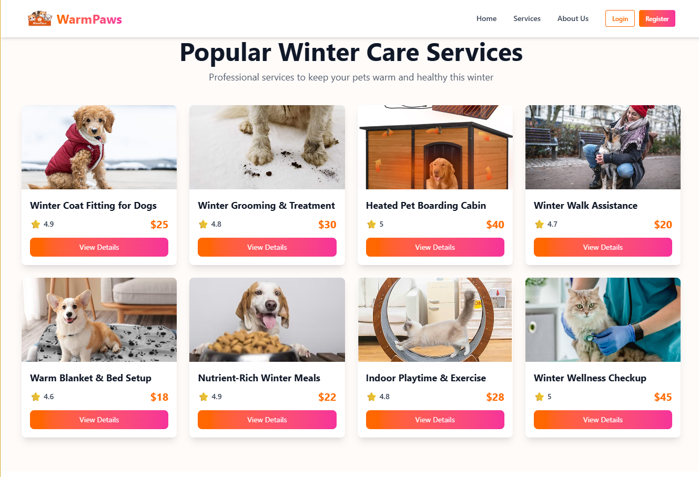

# WarmPaws - Pet Care in Winter

A cozy winter companion platform designed for pet owners to ensure their furry friends stay warm, safe, and healthy during the cold season. Users can explore local pet care services, winter pet clothing, grooming options, and expert tips — all in one friendly interface.

## Live Link 
 https://warmpaw-sami.netlify.app

##  Key Features

- **Hero Slider**: Automatic image carousel showcasing winter pet care services
- **Service Discovery**: Browse and book winter care services for pets
- **User Authentication**: Secure login/signup with Firebase Auth
- **Profile Management**: Update user profile information
- **Winter Care Tips**: Expert advice for pet winter care
- **Expert Veterinarians**: Meet our team of experienced vets
- **Membership Plans**: Choose from Basic, Comfort, or Premium plans
- **Responsive Design**: Fully responsive on mobile, tablet, and desktop
- **Modern UI**: Clean, minimalist design with smooth animations

##  Tech Stack

- **Frontend**: React 19.1.1
- **Routing**: React Router 
- **Styling**: Tailwind CSS 4.1.15 + DaisyUI 5.3.7
- **Authentication**: Firebase Auth
- **Animations**: AOS 2.3.4, Animate.css 4.1.1, React Spring 10.0.3
- **Notifications**: React Hot Toast 2.6.0
- **Image Slider**: Swiper 12.0.3
- **Build Tool**: Vite 7.1.7

##  Getting Started

### Prerequisites

- Node.js (version 16 or higher)
- npm or yarn

### Installation

1. Clone the repository:
```bash
git clone <repository-url>
cd WarmPaws
```

2. Install dependencies:
```bash
npm install
```

3. Start the development server:
```bash
npm run dev
```

4. Open your browser and navigate to `http://localhost:5173`

### Building for Production

```bash
npm run build
```

##  Pages & Features

### Home Page
- Hero slider with winter pet care imagery
- Popular winter care services grid
- Winter care tips section
- Expert veterinarians showcase
- Membership plans comparison

### Authentication
- **Login Page**: Email/password login with Google OAuth
- **Signup Page**: User registration with password validation
- **Forgot Password**: Password reset functionality
- **My Profile**: User profile management

### Service Details
- Detailed service information
- Booking form for service appointments
- Provider contact information
- Rating and review display

##  Design System

- **Color Palette**: Warm cream (#fffbf9) background with orange/pink gradients
- **Typography**: Modern, clean fonts with proper hierarchy
- **Components**: DaisyUI components with custom styling
- **Animations**: Smooth transitions and hover effects
- **Responsive**: Mobile-first design approach

##  Configuration

### Firebase Setup
The app uses Firebase for authentication. The configuration is set up in `src/firebase/config.js` with the following services:
- Authentication (Email/Password + Google OAuth)
- User profile management

### Environment Variables
Create a `.env` file in the root directory with your Firebase configuration:
```
VITE_FIREBASE_API_KEY=your_api_key
VITE_FIREBASE_AUTH_DOMAIN=your_auth_domain
VITE_FIREBASE_PROJECT_ID=your_project_id
VITE_FIREBASE_STORAGE_BUCKET=your_storage_bucket
VITE_FIREBASE_MESSAGING_SENDER_ID=your_messaging_sender_id
VITE_FIREBASE_APP_ID=your_app_id
```

##  NPM Packages Used

- **@tailwindcss/vite**: Tailwind CSS integration
- **animate.css**: CSS animation library
- **aos**: Animate On Scroll library
- **firebase**: Firebase SDK for authentication
- **react**: React library
- **react-dom**: React DOM rendering
- **react-hot-toast**: Toast notification library
- **react-router**: Client-side routing
- **react-router-dom**: DOM bindings for React Router
- **react-spring**: Spring physics animations
- **swiper**: Modern slider library
- **tailwindcss**: Utility-first CSS framework
- **daisyui**: Tailwind CSS component library

##  Deployment

The app is configured for deployment on platforms like Netlify or Vercel. The `public/_redirects` file ensures proper SPA routing.

